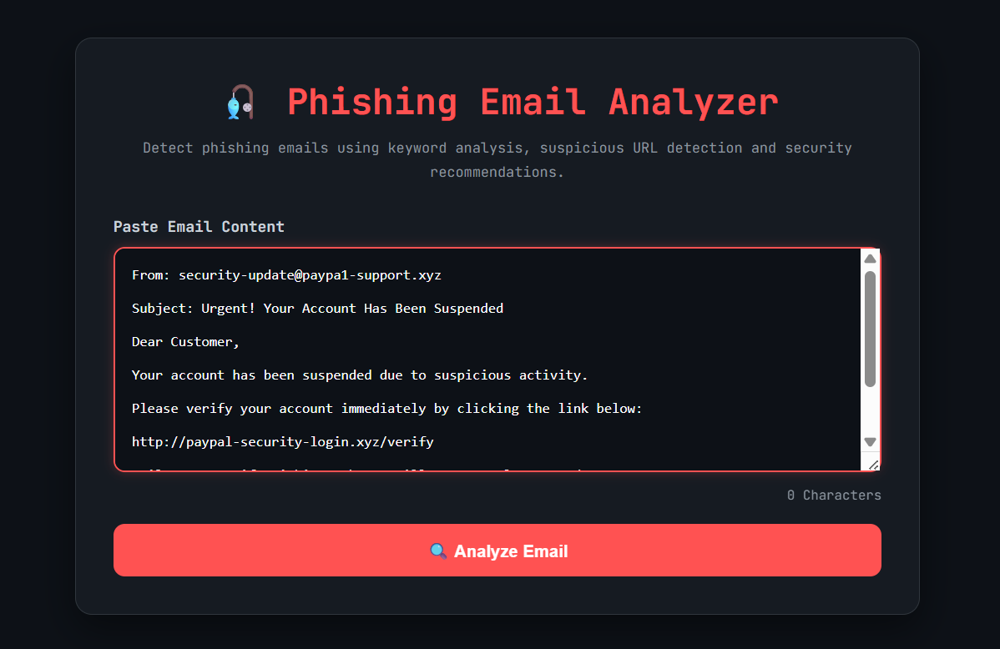
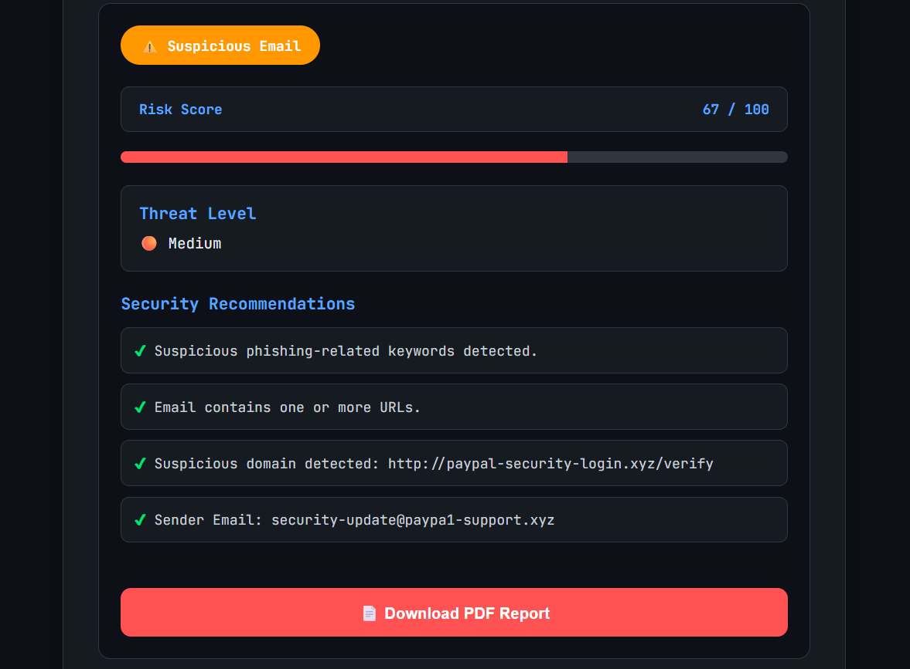

<h1 align="center">🎣 Phishing Email Analyzer</h1>

<p align="center">
A Python & Flask based cybersecurity web application that analyzes email content to detect phishing indicators, calculate a phishing risk score, classify threat levels, and generate downloadable PDF security reports.
</p>

<p align="center">

<a href="https://python.org">

</a>

<a href="https://flask.palletsprojects.com/">

</a>

<a href="https://phishing-email-analyzer-5lbf.onrender.com">

</a>

<a href="LICENSE">

</a>

</p>

---

# 📌 Overview

Phishing Email Analyzer is a Flask-based cybersecurity web application that analyzes email content to identify common phishing indicators.

The application detects suspicious keywords, extracts embedded URLs, identifies suspicious domains, extracts sender email addresses, evaluates phishing risk, classifies emails into Low, Medium, or High threat levels, and generates a downloadable PDF security report with actionable recommendations.

---

# ✨ Features

- ✅ Phishing Keyword Detection
- ✅ URL Detection using Regular Expressions (Regex)
- ✅ Suspicious Domain Detection
- ✅ Sender Email Extraction
- ✅ Uppercase Text Detection
- ✅ Multiple Exclamation Mark Detection
- ✅ Risk Score Calculation (0–100)
- ✅ Low / Medium / High Threat Classification
- ✅ Security Recommendations
- ✅ PDF Report Download
- ✅ Character Counter
- ✅ Responsive User Interface

---

# 📸 Screenshots

### 🏠 Home Page



### 🔍 Analysis Result



### 📄 PDF Report


---

# 🛠️ Tech Stack

- Python
- Flask
- HTML5
- CSS3
- JavaScript
- ReportLab
- Regular Expressions (Regex)

---

# 📂 Project Structure

```text
Phishing-Email-Analyzer/

│
├── app.py
├── requirements.txt
├── README.md
├── LICENSE
│
├── templates/
│   └── index.html
│
├── static/
│   ├── style.css
│   └── script.js
│
└── screenshots/
    ├── Home.png
    ├── Result.png
    └── PDF.png
```

---

# ⚙️ Installation

### Clone the repository

```bash
git clone https://github.com/SyedTaif/Phishing-Email-Analyzer.git
```

### Navigate to the project directory

```bash
cd Phishing-Email-Analyzer
```

### Install dependencies

```bash
pip install -r requirements.txt
```

### Run the application

```bash
python app.py
```

### Open in your browser

```text
http://127.0.0.1:5000
```

---

# 🚀 Live Demo

🌐 https://phishing-email-analyzer-5lbf.onrender.com

---

# 🔍 Detection Logic

The application analyzes email content using multiple phishing detection techniques:

- Suspicious keyword matching
- URL extraction using Regular Expressions (Regex)
- Suspicious domain detection
- Sender email extraction
- Uppercase text analysis
- Multiple exclamation mark detection
- Risk score calculation
- Threat level classification

---

# 📄 PDF Report

After analyzing an email, users can download a professional PDF report containing:

- Analysis Result
- Threat Level
- Risk Score
- Security Recommendations

---

# 🔮 Future Improvements

- Email Header Analysis
- .eml File Upload Support
- SPF / DKIM / DMARC Validation
- VirusTotal API Integration
- Domain Reputation Lookup
- Email Attachment Analysis
- Machine Learning Based Phishing Detection

---

# 👨‍💻 Author

**Syed Taif Ahmed**

🌐 GitHub: https://github.com/SyedTaif

💼 LinkedIn: https://www.linkedin.com/in/syed-taif-ahmed-ba8a683bb/

---

## ⭐ Support

If you found this project useful, consider giving it a ⭐ on GitHub.

---

## 📜 License

This project is licensed under the MIT License.
